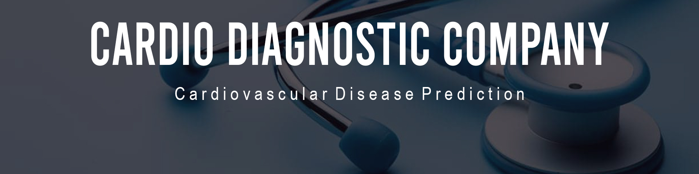
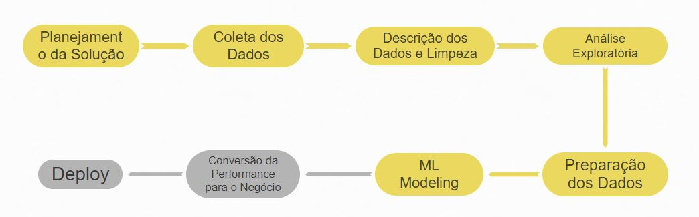

# Cardio Diagnostic Company
## Cardiovascular Disease Prediction

## 1.0 Contexto:

A Empresa Cardio Catch Diseases (CCD)
A Cadio Catch Diseases é uma empresa especializada em detecção de doenças cardíacas em estágios iniciais. O seu modelo de negócio é do tipo Serviço, ou seja, a empresa ofereço o diagnóstico precoce de uma doença cardiovascular por um certo preço.

Atualmente, o diagnóstico de uma doença cardiovascular é feita manualmente por uma equipe de especialistas. A precisão atual do diagnóstico varia entre 55% e 65%, devido a complexidade do diagnóstico e também da fadiga da equipe que se revezam em turnos para minimizar os riscos. O custo de cada diagnóstico, incluindo os aparelhos e a folha de pagamento dos analistas, gira em torno de 1.000 reais.

O preço do diagnóstico, pago pelo cliente, varia de acordo com a precisão conseguida pelo time de especialistas, o cliente paga 500 reais a cada 5% de acurácia acima de 50%. Por exemplo, para uma precisão de 55%, o diagnóstico custa 500 reais para o cliente, para uma precisão de 60%, o valor é de 1000 reais e assim por diante. Se a precisão do diagnóstico for 50% o cliente não paga por ele.

Observe que a variação da precisão dada pelo time de especialistas, faz com que a empresa tenha ora uma operação com lucro, receita maior que o custo, ora uma operação com prejuízo, receita menor que o custo. Essa instabilidade do diagnóstico faz com que a empresa tenha um Cashflow imprevisível.

Projeto retirado do Blog Seja Um Data Scientist
https://sejaumdatascientist.com/projeto-de-data-science-diagnostico-precoce-de-doencas-cardiovasculares/

Projeto original disponível na plataforma Kaggle
https://www.kaggle.com/sulianova/cardiovascular-disease-dataset

## 2.0 Ferramentas e Requisitos
1. Linguagem: Python
2. Desenvolvimento e entrega do projeto: Jupyter Notebook
3. Cloud: Heroku
4. Plataforma de request: Google Sheets
## 3.0 Business Assumptions
1. Valores de pressão, peso e altura fora da escala natural para seres humanos em proporções de multiplos de 10 (dez vezes maiores ou menores, cem vezes maiores ou menores) serão tratados como erros de imput e trazidos para a escala "normal".
2. Amostras que contiverem valores de pesos dentro do range "normal" da altura, e altura dentro do range natural de peso, serão tratados e considerados como invertidos. 
3. Os dados são balanceados em relação à target, 50% aproximadamente das amostras, são de pessoas com problemas cardíacos. Tal fato não é percebido na população como um todo, portanto, entende-se que há um viés de seleção, onde houve intenção de incluir no projeto a mesma quantidade de cardíacos e não cardíacos.
## 4.0 Planejamento da Solução:

### 4.1 Objetivos:

1. Qual a Acurácia e a Precisão da ferramenta?
2. Quanto lucro a Cardio Catch Diseases passará a ter com a nova ferramenta?
3. Qual a Confiabilidade do resultado dados pela nova ferramenta?

### 4.2 Entregas:
1. Alguns parâmetros da métrica
2. Um número que representa o total de retorno financeiro
3. Parâmetros de credibilidade

### 4.3 Estratégia da solução:
1. Tratamento dos dados, feature engineering, seleção de features, treinamento do modelo, configuração de hiperparâmetros, seleção de modelos.
2. Definir baseline, custos, faturamentos e margens envolvidas no cenário "AS IS". Utilizar métrica de performance do modelo para projetar o cenário "TO BE". Calcular diferenças de margens entre os cenários.
3. Realizar calculos por inferência bayesiana

### 4.4 Planejamento da execução:

1. Ciclo 1: Criar um pipeline de dados funcional de ponta a ponta, desde a coleta dos dados até o treinamento do modelo
2. Ciclo 2: Estatística de primeira e segunda ordens
3. Ciclo 3: Data cleaning
4. Ciclo 4: Exploração de dados
5. Ciclo 5: Criação de hipóteses de negócio
6. Ciclo 6: Testes de hipóteses
7. Ciclo 7: Seleção de features
8. Ciclo 8: Preparação dos dados
9. Ciclo 9: Aperfeiçoamento da performance de predições
10. Ciclo 10: Deploy

## 5.0 Top 3 Data Insights:
## 6.0 Machine Learning Model Aplicado:
## 7.0 Machine Learning Performance:
## 8.0 Business Results:
## 9.0 Lições Aprendidas
## 10.0 Glossário de Features:

### Natureza das features:

1. Objective: factual information;
2. Examination: results of medical examination;
3. Subjective: information given by the patient.

### Features:

1. Age | Objective Feature | age | int (days)
2. Height | Objective Feature | height | int (cm) |
3. Weight | Objective Feature | weight | float (kg) |
4. Gender | Objective Feature | gender | categorical code | 1 - women, 2 - men
5. Systolic blood pressure | Examination Feature | ap_hi | int |
6. Diastolic blood pressure | Examination Feature | ap_lo | int |
7. Cholesterol | Examination Feature | cholesterol | 1: normal, 2: above normal, 3: well above normal |
8. Glucose | Examination Feature | gluc | 1: normal, 2: above normal, 3: well above normal |
9. Smoking | Subjective Feature | smoke | binary |
10. Alcohol intake | Subjective Feature | alco | binary |
11. Physical activity | Subjective Feature | active | binary |
12. Presence or absence of cardiovascular disease | Target Variable | cardio | binary |

## 11.0 Próximos Passos: Comparar as performances entre os modelos de Machine Learning
## 12.0 Estágio do projeto:

